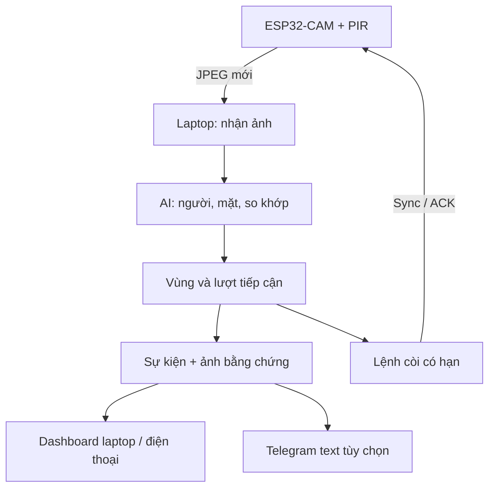
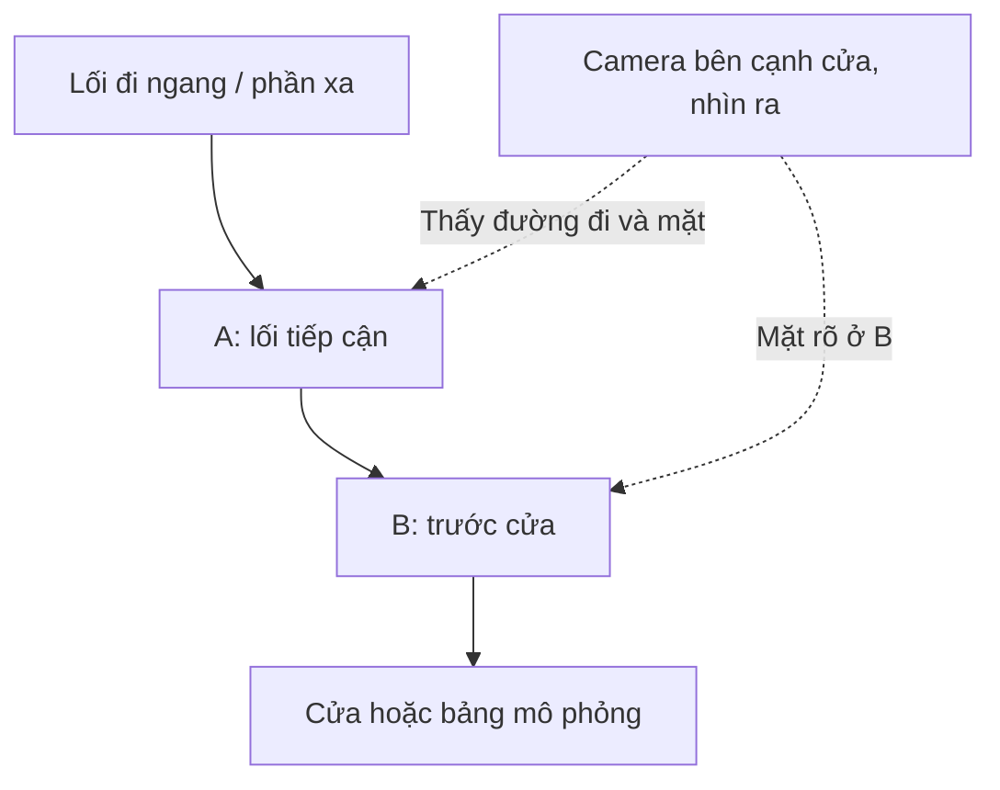

# Hiểu hệ thống Smart Security — tài liệu chung cho nhóm

**v2 · 01/10/2026 · Deadline khoảng tháng 11/2026.** Đây là bản giải thích sản phẩm và cách nhóm làm; quy tắc coding tại `docs/SPEC.md`, protocol tại `docs/CONTRACTS.md`.

Bản đọc riêng cho nhóm. Code và các tài liệu còn lại nằm trong ZIP Smart-Security-System-v2.

## Mục lục

1. [Bài toán và cách đọc tài liệu](#1-bài-toán-và-cách-đọc-tài-liệu)
2. [Khi nào chụp và nhận diện](#2-khi-nào-chụp-và-nhận-diện)
3. [Bố trí camera và demo](#3-bố-trí-camera-và-demo)
4. [Các tình huống và cảnh báo](#4-các-tình-huống-và-cảnh-báo)
5. [Đăng ký người quen](#5-đăng-ký-người-quen)
6. [AI hoạt động ra sao](#6-ai-hoạt-động-ra-sao)
7. [Linh kiện và lắp thử](#7-linh-kiện-và-lắp-thử)
8. [Còi, thông báo và xử lý lỗi](#8-còi-thông-báo-và-xử-lý-lỗi)
9. [Cách nhóm phối hợp](#9-cách-nhóm-phối-hợp)
10. [Phần đã có và phần cần nhóm kiểm chứng](#10-phần-đã-có-và-phần-cần-nhóm-kiểm-chứng)

## 1. Bài toán và cách đọc tài liệu

Hệ thống theo dõi **một lối tiếp cận cửa đã bố trí trước**, nhận biết người đã đăng ký và báo khi một người không khớp danh sách đó tiến vào vùng gần cửa. Đây là demo IoT + xử lý ảnh trên laptop, không phải hệ thống tự bảo đảm an ninh cho mọi loại nhà.

“Người quen” nghĩa là **người có mẫu đang active**. “Không khớp người đã đăng ký” nghĩa là mặt đủ rõ nhưng so với gallery không khớp qua nhiều ảnh. Không đăng ký không đồng nghĩa người đó có ý xấu. Người quay lưng hoặc mặt mờ thuộc “chưa xác định”, không tự bị gọi là người lạ.

Spec cũ có các thành phần hữu ích: yêu cầu, kiến trúc, API, test, làm nhóm. Cách chia đó hợp lệ nhưng 24 file gây nhiều lần chuyển trang và khó thấy luồng sản phẩm với nhóm mới. V2 giữ **một bản giải thích** và **hai tài liệu coding chính** thay vì tạo hai bộ spec đầy đủ giống nhau. Tham số nằm trong YAML, tránh sửa số ở nhiều nơi.

Ba người nên đọc tài liệu này một lượt, xem simulator và giải thích lại bằng lời của mình. Khi làm task, đọc mục liên quan ở SPEC/CONTRACTS; không cần nhớ công dụng mọi file ngay từ đầu.

ESP32 làm nhiệm vụ đo/chụp/truyền và thực thi còi; laptop chạy model và quyết định cảnh báo. Gallery ở laptop, không nằm trong RAM ESP32. Internet không cần cho đường chụp → AI → còi/dashboard trong LAN.

## 2. Khi nào chụp và nhận diện?

Có ba hoạt động khác nhau; chúng không nhất thiết bắt đầu cùng lúc.

| Hoạt động | Khi bắt đầu | Mục đích |
|---|---|---|
| Chụp ảnh | Khi ARMED: ảnh định kỳ; PIR HIGH tăng nhịp chụp | Không bỏ hoàn toàn người mà PIR không bắt được |
| Phát hiện và theo dõi người/mặt | Trên ảnh mới khi ARMED | Biết người ở vùng nào, giữ track và chiều tiếp cận |
| So khớp danh tính | Khi đối tượng nằm ở vùng gần cửa B và mặt đủ chất lượng | Tránh nhận diện tất cả người ngoài đường |

PIR phát hiện thay đổi bức xạ hồng ngoại trong vùng cảm biến. Tín hiệu đó không chứa tên người, khoảng cách hay hướng đi. Vì vậy **PIR chỉ điều khiển nhịp ảnh**, không phải điều kiện duy nhất để kết luận tiếp cận hoặc bật còi [R03 trong RESEARCH].

Khi ARMED, seed là một ảnh/giây; khi PIR có chuyển động hoặc server còn thấy người, target là hai ảnh/giây. FPS gửi và FPS AI phân tích là hai số khác nhau. Camera không chụp lại “cho đủ” sau khi mạng bị chậm; server ưu tiên ảnh mới nhất.

DISARMED dừng giám sát. Admin có thể yêu cầu preview 30 giây để chỉnh góc, hoặc enrollment có thời hạn để đăng ký. Hai chế độ đó không tạo cảnh báo người lạ.

### Hai vùng A/B

- **A — vùng tiếp cận:** một đoạn đường đi trước cửa mà người vào sẽ đi qua.
- **B — vùng gần cửa:** phần sàn/vị trí đứng sát cửa mà hệ thống tập trung nhận diện.
- Phần ảnh còn lại nằm ngoài hai vùng. Người ở đó không được so danh tính trong giám sát.

Hai vùng không chồng lên nhau. Trong mã nền, vị trí lấy theo **tâm bounding box người** trên ảnh, không đo mét và không dùng cảm biến khoảng cách. Vẽ vùng sao cho cùng một người đứng ở A/B có tâm bbox phân tách rõ. Nếu camera nhìn quá thẳng dọc lối đi, tâm bbox ở xa/gần có thể trùng; lúc đó đổi góc camera hoặc thiết kế vùng khác, không cố chữa bằng threshold khuôn mặt.

Vào vùng được xác nhận bằng nhiều ảnh liên tiếp, giảm rung ở biên. Một track đã ổn định ở A rồi đi qua khoảng trống vào B trong thời gian liên tục được coi là **incoming**. Track mất quá lâu, đổi do che khuất hoặc xuất hiện ngay ở B thì **chưa rõ chiều đi**; hệ thống không đoán rằng người đó vừa đi từ đường vào.

So khớp mặt có thể bắt đầu ngay khi quan sát nằm ở B; phát còi còn đòi vùng B đã ổn định, đủ thời gian hiện diện, chiều incoming và nhiều quan sát unknown đủ rõ. Bản chất là xác nhận theo chuỗi ảnh, không “PIR vừa HIGH là hú”.

## 3. Bố trí camera và demo

### 3.1 Bố trí hợp lý cho bài toán này

Gắn camera cố định **gần cửa, hướng ra phía người đang tiếp cận**, hơi lệch sang một bên để thấy cả A và B. Mục tiêu kép: thấy đường đi đủ để suy ra A → B và thấy mặt chính diện hoặc quay nhẹ ở B.

Điểm xuất phát để thử: camera cao khoảng 1,3–1,6 m, góc chếch nhẹ, người ở B cách khoảng 0,8–1,5 m. Đây là **gợi ý bố trí của dự án**, không thông số bảo đảm của OV2640. Chốt bằng ảnh thực: mặt ở B đạt kích thước/chất lượng cần thiết, thân người có bbox ổn định, không bị cánh cửa/đồ vật che.

| Tránh | Vì sao | Sửa |
|---|---|---|
| Camera quá cao và nhìn xuống đỉnh đầu | Mặt khó thấy, pose lệch | Hạ/đổi góc gần ngang mặt hơn |
| Đặt trong nhà nhìn theo lưng người vừa vào | Vào cửa nhưng mặt quay khỏi camera | Đặt hướng ra người đến, hoặc thay bài toán/thiết kế khác |
| Bao trùm cả đường/cửa nhiều nhà | Người đi ngang dễ lọt vùng, thiếu kiểm soát demo | Thu góc, khoanh lối tiếp cận riêng |
| B ngược sáng mạnh | Mặt tối dù ảnh nền sáng | Đổi hướng hoặc bổ sung ánh sáng đều |
| A/B cùng chiếm một vị trí tâm bbox | Không phân biệt gần/xa bằng vùng ảnh | Đổi góc hoặc dùng geometry khác sau thí nghiệm |
| Camera cầm tay/dịch chuyển giữa các lần | ROI và calibration mất ý nghĩa | Dùng giá cố định, đánh dấu vị trí |

Baseline thực hiện **trong nhà hoặc mô hình lớp học đủ sáng**. Chưa xác nhận dùng ngoài trời mưa/nắng/ban đêm. Không mua camera chỉ vì tiêu đề quảng cáo “AI”; đầu tiên phải kiểm nguồn, PSRAM và ảnh thực.

### 3.2 Demo với người thật

Dùng cửa lớp hoặc một tấm bảng làm cửa giả. Dán băng keo trên sàn: điểm A trước cửa, điểm B gần cửa và một đường đi ngang ngoài B. Giữ lối đi thông thoáng; nhóm biết hướng “vào” và “ra”. Camera/đèn/đánh dấu không đổi trong buổi đo.

Sơ đồ dưới mô tả **quan hệ các khu vực**, không phải bản vẽ đo đạc hay ROI mẫu có thể copy vào mọi camera:

Trước demo, chụp người ở từng điểm A/B, dọc biên và ở đường đi ngang. Vẽ A/B trên ảnh bằng tọa độ normalized trong config, chạy các đường đi thật để kiểm classification. Mỗi vùng cần người xuất hiện ở ít nhất hai ảnh; bắt đầu thử với tốc độ đi chậm bình thường rồi tăng, công bố giới hạn tốc độ đã kiểm chứng.

Một camera chưa bảo đảm phân biệt mọi hướng nếu nhiều người che nhau, đi tắt vào B hoặc chạy quá nhanh. Những tình huống đó được đưa vào warning/test riêng. Nếu cần đo chiều vào/ra chắc hơn với lối đi phức tạp, xem phương án hai cảm biến cắt tia hoặc camera bổ sung ở RESEARCH; **chưa cần mua cho core hiện tại**.

## 4. Các tình huống và cảnh báo

| Tình huống | Hệ thống làm gì | Còi |
|---|---|---|
| Người đi ngang ngoài B, kể cả PIR kích | Chụp/track ở A hoặc ngoài vùng; không so mặt tại vùng xa | Không |
| Người đứng từ xa, mặt nhỏ | Không đủ vùng/chất lượng để kết luận danh tính gần cửa | Không |
| Người quen A → B, mặt rõ | Xác nhận cùng danh tính qua nhiều ảnh; log thông tin | Không |
| Người chưa đăng ký A → B, mặt rõ, đứng đủ | Xác nhận không khớp; event alarm + ảnh nếu có + lệnh còi | Một lần ngắn nếu không cooldown/silence |
| Có người ở B nhưng quay lưng/mờ/che mặt | Sau đủ hiện diện và quan sát: “chưa xác định, cần kiểm tra” | Không |
| Xuất hiện thẳng ở B | Danh tính có thể rõ nhưng không có bằng chứng A → B; cảnh báo chiều chưa rõ nếu tồn tại lâu | Không tự hú |
| Người từ trong đi ra B → A | Không đủ chuỗi incoming để bật còi; ở B ban đầu có thể warning chiều chưa rõ | Không |
| A → B rồi quay ra và tiếp cận lại | Lượt mới; không kéo còi của lượt cũ sang lượt mới | Theo lượt mới và cooldown |
| Một người quen đứng lâu, người chưa đăng ký đến sau | Track/lượt của người mới được xét riêng | Vẫn có alarm cho người mới |
| Hai người: quen + không khớp | Xét từng người; kết quả quen không xóa kết quả người kia | Theo người không khớp |
| Hai người che/cắt ngang làm track mơ hồ | Reset continuity/phiếu, không truyền danh tính quen tùy tiện | Chưa rõ thì warning |
| Hơn hai người trong A/B | Warning vượt capacity, giữ kết quả riêng còn tin được | Không hú chỉ do số lượng |
| Có mặt rõ nhưng không gắn được thân người | Có thể so mặt ở B; geometry/chiều chưa chắc | Không hú từ face-only |
| Gallery rỗng, thiếu model, calibration chưa đạt | Chặn arm hoặc báo lỗi hệ thống | Không |
| Wi-Fi/camera/AI bị ngắt | Hiện offline/fault; không coi là “không có người” | Còi cũ tự tắt |

Giá trị seed: xác nhận 3 quan sát trong cửa sổ 5, các quan sát đủ cách nhau, kết quả có freshness. Các số đó cần validation; không phải cứ có ba ảnh bất kỳ là chắc đúng. Phiếu mờ không được tính thành unknown.

### Lượt tiếp cận khác “một phiên camera có người”

Một **track** là ID tạm để nối bbox giữa các ảnh. Một **visit/lượt** bắt đầu khi track ổn định vào B, có ID riêng và direction riêng. Trong lượt đó mỗi loại cảnh báo chỉ được ghi một lần.

Không dùng một incident chung kéo dài miễn còn người đứng trong ảnh để quyết định “cả phiên đã hú rồi”. Cách đó có thể bỏ người lạ mới đến khi người quen vẫn đứng. V2 chống lặp **theo lượt/track**, kết hợp cooldown âm thanh toàn thiết bị. Lượt thứ hai vẫn có event ngay cả khi cooldown chưa cho còi kêu; không hẹn còi muộn sau khi người đã đi.

Nếu tracking bị mất, lượt mới không kế thừa known/incoming. Điều này có thể tăng warning, nhưng giúp tránh nhận nhầm người thứ hai. Hệ thống không phải bộ đếm chính xác mọi lượt ra/vào nhà.

## 5. Đăng ký người quen

### 5.1 Người dùng cần làm gì?

1. Admin đăng nhập; giải thích việc lưu mẫu và ghi nhận người tham gia đồng ý.
2. Tạo hồ sơ tên hiển thị. Tên chỉ là nhãn, ID người là UUID.
3. Tắt giám sát, chọn Đăng ký trên đúng hồ sơ. Hệ thống STOP còi và dành camera cho enrollment.
4. Một người đứng ở vị trí nhận diện B, đủ sáng, mặt không bị vật che. Chụp **hai lượt**, mỗi lượt tối thiểu 5 mẫu đạt và khác nhau đủ.
5. Lượt 1 nhìn thẳng và quay nhẹ trái/phải; giữ yên ngắn để tránh mờ. Không yêu cầu cúi/ngẩng cực đoan hoặc quay ngang 90°.
6. Lùi ra nghỉ ngắn, đổi góc/khoảng cách nhẹ hoặc ánh sáng thường dùng; admin bấm bắt đầu lượt 2. Nếu thường đeo kính, thu điều kiện kính thường dùng; không cần ép nhiều phụ kiện ngoài demo.
7. Dashboard báo mẫu đạt/bị loại và lý do. Gặp trùng ảnh thì đổi pose; gặp nhiều mặt thì người còn lại ra khỏi khung; mặt nhỏ/mờ thì sửa vị trí/ánh sáng trước.
8. Lưu mẫu. Nếu calibration chưa hợp lệ hoặc chưa đủ limit quy mô, mẫu lưu **draft**, chưa active. Có thể dùng draft cho evaluation offline, rồi kích hoạt sau khi reviewer chốt profile.
9. Hệ thống về DISARMED. Chạy kiểm tra nhận diện với lượt khác trước khi arm giám sát.

Đăng ký có thời hạn 10 phút seed. Hủy/hết hạn làm sạch mẫu staging; không để hệ thống tự arm khi đang đăng ký dở. Muốn đăng ký lại người đang active, vô hiệu trước. Mã nền thu tối đa 5 mẫu mỗi lượt để tránh lấp quota bằng hàng trăm ảnh giống nhau.

### 5.2 Những kiểm tra không được bỏ

| Kiểm tra | Khi không đạt |
|---|---|
| Đúng một mặt; không có nhiều thân người | Loại, yêu cầu một người trước camera |
| Mặt đủ lớn, landmark hợp lệ | Loại, đổi khoảng cách/góc |
| Không mờ/không quá tối hoặc cháy sáng | Loại, giữ yên/sửa ánh sáng |
| Hai ảnh không gần như giống hệt | Loại mẫu trùng; spacing tối thiểu và hash ảnh |
| Mẫu mới tương thích các mẫu cùng phiên | Chặn mẫu nghi lẫn người; admin xem lại hoặc đăng ký lại |
| Mẫu quá giống một người đã đăng ký khác | Chặn để review, không tự tạo danh tính trùng |
| Đủ hai lượt và đủ mẫu trước commit | Chưa cho lưu gallery hoàn chỉnh |

Kiểm consistency/duplicate sử dụng threshold seed và phải đo lại. Nó giúp phát hiện lỗi dữ liệu, **không chứng minh liveness hay danh tính ngoài đời**. Admin vẫn kiểm người đang được đăng ký. Ảnh in/màn hình có thể đánh lừa face model.

### 5.3 Hệ thống lưu gì?

Mỗi mặt đạt được căn chỉnh rồi chuyển thành vector embedding. Gallery lưu 5–10 vector/người, kèm chất lượng, model/preprocess version và consent. **Mã nền không giữ ảnh gốc enrollment** sau phiên; ảnh mới nhất chỉ ở RAM. Embedding vẫn cần bảo vệ, không phải dữ liệu vô hại.

Đổi recognizer/preprocess thì phải thu lại mẫu theo baseline hiện tại, vì không có ảnh gốc để tái trích xuất. Nếu nhóm muốn lưu crop để tái trích xuất, đó là thay đổi có chủ đích về schema/consent/retention, cần issue riêng; không tự thêm kho ảnh người vào Git.

## 6. AI hoạt động ra sao?

| Bước | Mô hình/logic | Kết quả |
|---|---|---|
| Tìm người | NanoDet ONNX, CPU | Bbox thân người, kể cả không thấy mặt |
| Tìm mặt | YuNet | Bbox mặt + 5 landmark |
| Kiểm và căn chỉnh mặt | Size, blur, exposure, landmark; alignCrop | Mặt đủ điều kiện hoặc lý do loại |
| Trích đặc trưng | SFace | Vector 128 chiều với artifact hiện tại |
| So khớp | Cosine với gallery | Known / unknown / uncertain |
| Nối theo thời gian | Bbox tracking bảo thủ | Track và chuỗi A/B |
| Quyết định | Policy theo lượt + freshness + nhiều phiếu | Info / warning / alarm |

Phát hiện người và mặt độc lập; không thấy mặt không đồng nghĩa không có người. Face-only có thể hỗ trợ danh tính nhưng không đủ xác nhận đường A → B. Khi gán mặt vào nhiều thân người đều hợp lý, giữ mơ hồ, không chọn đại người gần nhất.

Cosine cao hơn thường nghĩa vector giống hơn. Score 0,8 **không có nghĩa xác suất đúng 80%**. Cần ngưỡng nhận, ngưỡng loại thấp hơn và khoảng cách với người tốt thứ hai. Vùng giữa hai ngưỡng để “chưa xác định”, tránh ép mọi khách vào một tên.

Nhóm dùng pretrained, không train mạng từ đầu. Việc AI cần làm là chọn/khóa artifact, chất lượng ảnh, gallery, threshold, tracking, dataset split và báo cáo sai số. Benchmark có sẵn của model không phải accuracy trên camera của nhóm [R04–R06].

Mục tiêu cuối là 20 người thật đã đăng ký và hai người đồng thời. Bắt đầu đo với 3–5 người. `validated_gallery_limit` phản ánh quy mô đã có bằng chứng; phần mềm không tự coi limit 20 trong config là đã đo đủ 20.

## 7. Linh kiện và lắp thử

### 7.1 Chốt phần cứng core

Giữ **ESP32-CAM AI-Thinker + OV2640 có PSRAM, PIR HC-SR501 và active buzzer module có driver nhận logic 3,3 V**. Bổ sung đầy đủ đế nạp, nguồn, cáp và giá cố định. Không cần đổi sang S3 chỉ để chạy AI vì inference nằm ở laptop.

**Không cần thêm cảm biến để làm demo đường A → B đã kiểm soát.** PIR không được dùng như cảm biến chiều; phần camera đảm nhiệm geometry. Relay không cần cho buzzer module nhỏ đã có driver. Không mua khóa cửa/SD/LCD ở lượt đầu.

### 7.2 BOM dự trù

Đây là **khoản phân bổ ngân sách**, không báo giá thị trường tháng 10. Xác nhận board/module/thông số và giá thực với người bán trước mua. Laptop/router/đèn phòng đã có không tính vào bảng.

| Hạng mục | Số lượng | Trần dự trù VNĐ | Điều kiện |
|---|---:|---:|---|
| ESP32-CAM AI-Thinker + OV2640 | 1 | 250.000 | PSRAM hoạt động, đúng pinout |
| Đế nạp ESP32-CAM-MB tương thích | 1 | 70.000 | USB/cáp đúng, nạp được |
| PIR HC-SR501 | 1 | 50.000 | Xác nhận OUT 3,3 V, có jumper/delay |
| Active buzzer module có driver | 1 | 40.000 | Input logic 3,3 V, active level rõ |
| Nguồn USB 5 V, định mức 2 A | 1 | 100.000 | Nguồn thành phẩm chất lượng |
| Cáp USB ngắn có data | 1 | 40.000 | Nạp và giảm sụt áp |
| Breadboard + dây + phụ kiện | 1 bộ | 70.000 | Tiếp xúc chắc, dây ngắn |
| Giá camera/hộp thoáng | 1 | 60.000 | Giữ góc cố định |
| Vận chuyển/thay linh kiện | — | 150.000 | Dự phòng |
| **Tổng phân bổ** | | **930.000** | Giữ tổng thanh toán dưới 1 triệu |

Module chưa có driver thì thêm transistor/điện trở phù hợp hoặc đổi module có driver; không cấp dòng công suất trực tiếp từ GPIO. Nếu module/board khác pin hoặc vượt trần ngân sách, cập nhật BOM và quyết định trước khi lắp.

### 7.3 Sơ đồ đấu dây logic

| Chân/chức năng | Nối dự kiến | Lưu ý |
|---|---|---|
| Nguồn camera | 5 V/GND qua đế/board theo tài liệu thực | Một nguồn chính; không nối hai nguồn 5 V tùy tiện |
| PIR VCC/GND | Theo module, thường 5 V, chung GND | Đo/đối chiếu module thực |
| PIR OUT | GPIO13 | Không đưa tín hiệu 5 V vào ESP32 |
| Buzzer input | GPIO14 | Driver/module nhận logic 3,3 V |
| Buzzer VCC/GND | Theo module, GND chung | GPIO chỉ làm tín hiệu |
| Camera OV2640 | FPC và pin map AI-Thinker | Không copy pin map board S3/WROVER |

GPIO13/14 dùng khi **không bật microSD**. GPIO0/2/12/15 liên quan boot/strap, GPIO4 flash, GPIO16 liên quan PSRAM trên board baseline; tránh phân chân tùy tiện [R02]. Còi OFF khi boot cần active level đúng và phần điện giữ OFF khi chân còn chưa cấu hình; phần mềm không sửa được module tự kêu do mạch reset sai.

### 7.4 Bring-up theo thứ tự

Camera chưa nối cảm biến → kiểm PSRAM/ảnh 30 phút → PIR/warm-up → buzzer/test OFF khi reset → upload/sync → cố định góc/vùng → AI. Ngắt nguồn trước đổi dây/FPC. Ghi nguồn/cáp/board revision và ảnh nối dây để người thứ hai kiểm tra.

Ảnh sọc/reset: kiểm nguồn, cáp, tiếp xúc, FPC và PSRAM trước. Không tắt brownout. Camera VGA/JPEG là seed phù hợp để bắt đầu với driver và Wi-Fi; chất lượng/độ trễ phải đo [R01].

## 8. Còi, thông báo và xử lý lỗi

Cảnh báo là **quyết định phần mềm**. Lệnh là **yêu cầu thực thi**. ACK là **thiết bị phản hồi**. Chỉ thấy event đỏ chưa chứng minh còi đã kêu; dashboard hiển thị command pending/acked/rejected riêng.

- Unknown incoming đủ điều kiện: alarm event; còi seed 2 giây, hard cap 3 giây, TTL bắt đầu lệnh 5 giây.
- Cùng lượt không hú theo từng frame. Hai lượt sát nhau vẫn log đủ; cooldown toàn thiết bị 10 giây có thể tắt âm lượt sau và ghi rõ lý do.
- **Đánh dấu đã xem:** chỉ acknowledge event. **Silence:** STOP còi và tắt audible cho lượt đang active. **Disarm:** dừng giám sát, xóa trạng thái lượt/pending cũ và STOP.
- Test còi chỉ khi DISARMED, tối đa 1 giây. Enrollment/preview không dùng làm lý do bật còi.
- Lệnh lặp không kéo dài còi. STOP có generation cao hơn; START cũ đến sau không bật lại. Deadline chạy ở task riêng với kiểm tra mỗi khoảng 20 ms.
- Mất control quá 5 giây thì OFF; hard cap mỗi lần vẫn áp dụng ngay cả khi server lỗi. Board/server restart không tự arm/phát lại còi cũ.

**Thông báo trên điện thoại cùng LAN:** mở dashboard responsive, thấy warning/event như trên laptop. Đây không phải push notification chạy nền.

**Telegram extension:** laptop gửi text qua outbox riêng, mặc định tắt, retry hữu hạn và hết hạn alert cũ. Không gửi ảnh mặt mặc định. Nhóm chủ động tạo bot/chọn chat trước bật; không phụ thuộc Telegram để còi hoạt động. Timeout provider có thể khiến gửi trùng nên không hứa exactly-once [R09].

| Sự cố | Hành vi cần thấy |
|---|---|
| Mất Internet, LAN còn | Core vẫn chạy; extension pending/failed riêng |
| Board mất Wi-Fi | Offline; ảnh cũ có tuổi ảnh; còi tự OFF |
| Laptop sleep/tắt | Không giám sát được; board không tự nhận diện |
| AI lỗi/ảnh quá cũ | Không ra quyết định danh tính từ ảnh đó, báo fault/stale |
| Server restart | DISARMED; hello lại; admin arm sau kiểm tra |
| Gallery/model/calibration không phù hợp | Chặn arm, lý do rõ |
| Ảnh evidence ghi lỗi | Log event nếu DB còn ghi được; ghi rõ ảnh thiếu |
| DB không ghi được | Storage fault; ngừng tạo alarm mới, không giả báo đã lưu |

## 9. Cách nhóm phối hợp

| Vai trò | Việc chính | Cần người khác review |
|---|---|---|
| A — Thiết bị/tích hợp | BOM, nguồn, camera, PIR, còi, firmware, HIL, đường mạng | C review protocol; B review ảnh/vị trí |
| B — AI/dữ liệu | Gallery, quality, matching/tracker, vùng, dataset, calibration/evaluation | A review đầu vào; C review interface/policy |
| C — Backend/chất lượng | API/auth/DB, worker/revision, event/command, dashboard, CI/backup | A review còi/protocol; B review AI semantics |

Cả nhóm thu/gán nhãn/chạy tình huống, không để B tự chuẩn bị mọi dữ liệu và tự nghiệm thu chính mình. C không chỉ làm web; A không chỉ stream camera; B không chỉ thử vài ảnh quen.

Mỗi người có nhánh ngắn theo issue. `main` nhận PR đã được ít nhất một người khác xem. Không chia ba nhánh dài theo tên thành viên rồi ghép cuối kỳ. Mỗi lần đổi contract phải ghép producer/consumer cùng PR hoặc chia PR có thứ tự rõ và fixture chung.

Hai người không giữ board vẫn dùng simulator phát triển. Agent của từng người chỉ đọc docs/file cần cho issue; không để hai agent cùng sửa `service.py`/`contracts.py` lúc một người đang ghép. PLAN có vùng ownership, thứ tự migration và prompt giao task ngắn.

## 10. Phần đã có và phần cần nhóm kiểm chứng

**Có trong gói:** mã nền backend/API/auth/SQLite; chính sách per-visit; OpenCV wrappers + exact manifest; enrollment hai lượt; dashboard; simulator; firmware; test logic/contract; công cụ model/evaluation/backup. Mã cần được nhóm đọc/test trên máy mình, không chỉ copy rồi kết luận mọi gate pass.

**Còn phải đo:** board/nguồn/PIR/buzzer thật, biên A/B ngoài đời, độ rõ/size mặt, tốc độ người đi, threshold và sample consistency, dataset holdout, multi-person, latency và soak. Calibration seed chưa active. Bảng nghiệm thu có PASS/FAIL/NOT TESTED riêng.

**Ngày nộp:** khoảng tháng 11/2026. Nhóm chốt ngày cụ thể theo giảng viên rồi rút/giãn các mốc trong PLAN; không còn lịch kéo sang năm 2027. Core và bằng chứng là ưu tiên trước Telegram/remote.
